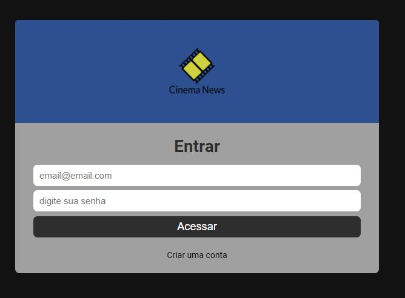
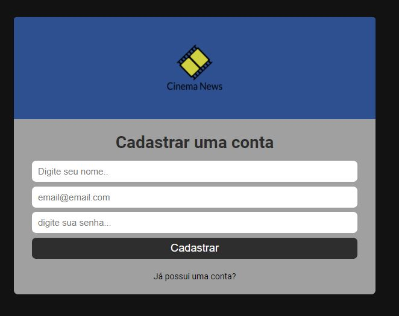
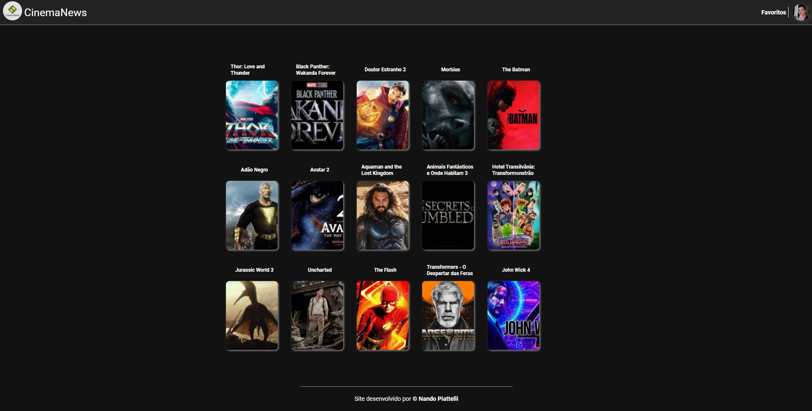
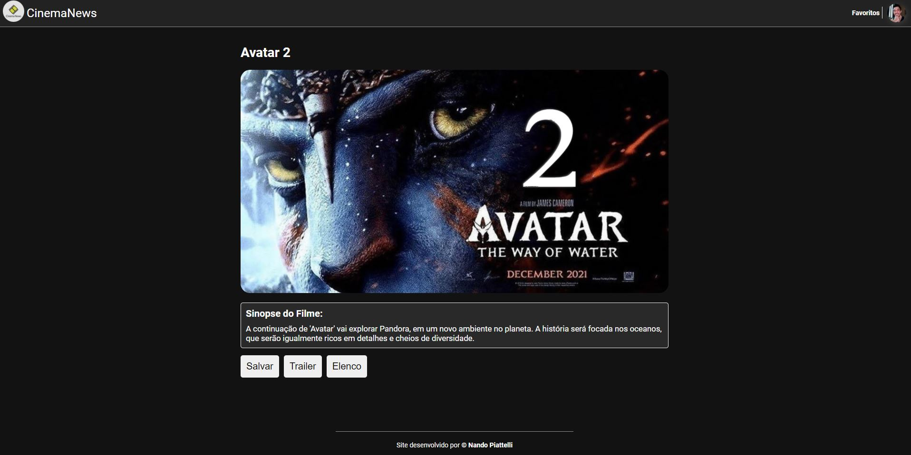
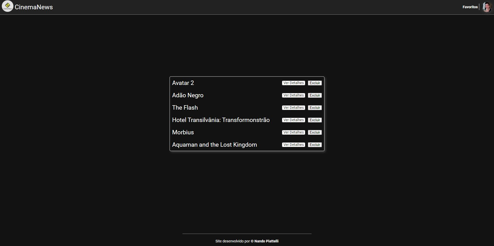
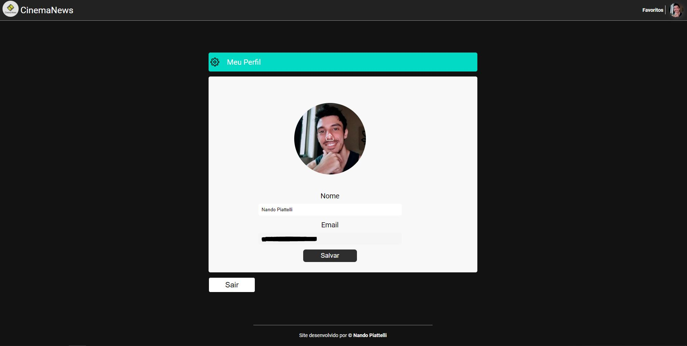

# Projetos-React

# Objetivo

Desenvolver uma aplicação Web onde o usuário consiga verificar os filmes que serão lançados.
Foi utilizado sistema de login e rotas privadas para acesso na aplicação.
O sistema de login utiliza as tecnologia do firebase authentication com email e senha.
A aplicação permite que o usuário selecione uma imagem de avatar JPEG ou PNG que será armazenada no Storage do FireBase.
Foi utilizado uma ApiRest fake para funcionalidades do projeto e exibição dos filmes.
É possível o usuário adicionar filmes a sua lista de favoritos.
Ao abrir um filme o usuário tem acesso a imagem do filme, sinopse e três opções: Salvar nos favoritos, ver o trailer (redireciona ao youtube) e ver o elenco(redireciona ao google)

# Tecnologias

Para desenvolver o projeto foram utilizados:
- JavaScript
- React
- ContextAPI
- Firebase
- FireStore
- Storage
- Firebase Authentication
- ApiRest Fake

Algumas dependências legais que foram utilizadas:

- Axios
- Toastify
- React-Router-Dom
- React Icons 

# Layout Web

## Login e Cadastro

## Home

## Filme

## Favoritos

## Profile

# Clone

Caso queira verificar o aplicativo rodando em sua máquina,  
basta clonar o repositório e através do terminal acessar a pasta clonada.  
Como não faz sentido subir a pasta node_modules pro git, você irá perceber que a mesma está faltando.  
Para resolver, muito simples, basta executar o comando "npm i -E" que todas as dependências necessárias  
serão lidas no package.json e baixadas em sua máquina. Depois basta executar o projeto normalmente.

# Créditos

O app foi desenvolvido por Nando Piattelli (https://github.com/nandowl)

 
 

----------------------------------------------------------------------------------------------------------------------------------------------------

# Getting Started with Create React App

This project was bootstrapped with [Create React App](https://github.com/facebook/create-react-app).

## Available Scripts

In the project directory, you can run:

### `npm start`

Runs the app in the development mode.\
Open [http://localhost:3000](http://localhost:3000) to view it in the browser.

The page will reload if you make edits.\
You will also see any lint errors in the console.

### `npm test`

Launches the test runner in the interactive watch mode.\
See the section about [running tests](https://facebook.github.io/create-react-app/docs/running-tests) for more information.

### `npm run build`

Builds the app for production to the `build` folder.\
It correctly bundles React in production mode and optimizes the build for the best performance.

The build is minified and the filenames include the hashes.\
Your app is ready to be deployed!

See the section about [deployment](https://facebook.github.io/create-react-app/docs/deployment) for more information.

### `npm run eject`

**Note: this is a one-way operation. Once you `eject`, you can’t go back!**

If you aren’t satisfied with the build tool and configuration choices, you can `eject` at any time. This command will remove the single build dependency from your project.

Instead, it will copy all the configuration files and the transitive dependencies (webpack, Babel, ESLint, etc) right into your project so you have full control over them. All of the commands except `eject` will still work, but they will point to the copied scripts so you can tweak them. At this point you’re on your own.

You don’t have to ever use `eject`. The curated feature set is suitable for small and middle deployments, and you shouldn’t feel obligated to use this feature. However we understand that this tool wouldn’t be useful if you couldn’t customize it when you are ready for it.

## Learn More

You can learn more in the [Create React App documentation](https://facebook.github.io/create-react-app/docs/getting-started).

To learn React, check out the [React documentation](https://reactjs.org/).

### Code Splitting

This section has moved here: [https://facebook.github.io/create-react-app/docs/code-splitting](https://facebook.github.io/create-react-app/docs/code-splitting)

### Analyzing the Bundle Size

This section has moved here: [https://facebook.github.io/create-react-app/docs/analyzing-the-bundle-size](https://facebook.github.io/create-react-app/docs/analyzing-the-bundle-size)

### Making a Progressive Web App

This section has moved here: [https://facebook.github.io/create-react-app/docs/making-a-progressive-web-app](https://facebook.github.io/create-react-app/docs/making-a-progressive-web-app)

### Advanced Configuration

This section has moved here: [https://facebook.github.io/create-react-app/docs/advanced-configuration](https://facebook.github.io/create-react-app/docs/advanced-configuration)

### Deployment

This section has moved here: [https://facebook.github.io/create-react-app/docs/deployment](https://facebook.github.io/create-react-app/docs/deployment)

### `npm run build` fails to minify

This section has moved here: [https://facebook.github.io/create-react-app/docs/troubleshooting#npm-run-build-fails-to-minify](https://facebook.github.io/create-react-app/docs/troubleshooting#npm-run-build-fails-to-minify)
=======
# cinemanews
Projeto de listagem de filmes que serão lançados utilizando apirest fake
>>>>>>> ceae1d9033a52e6ee0207b5f72c0bef78cb12f38
